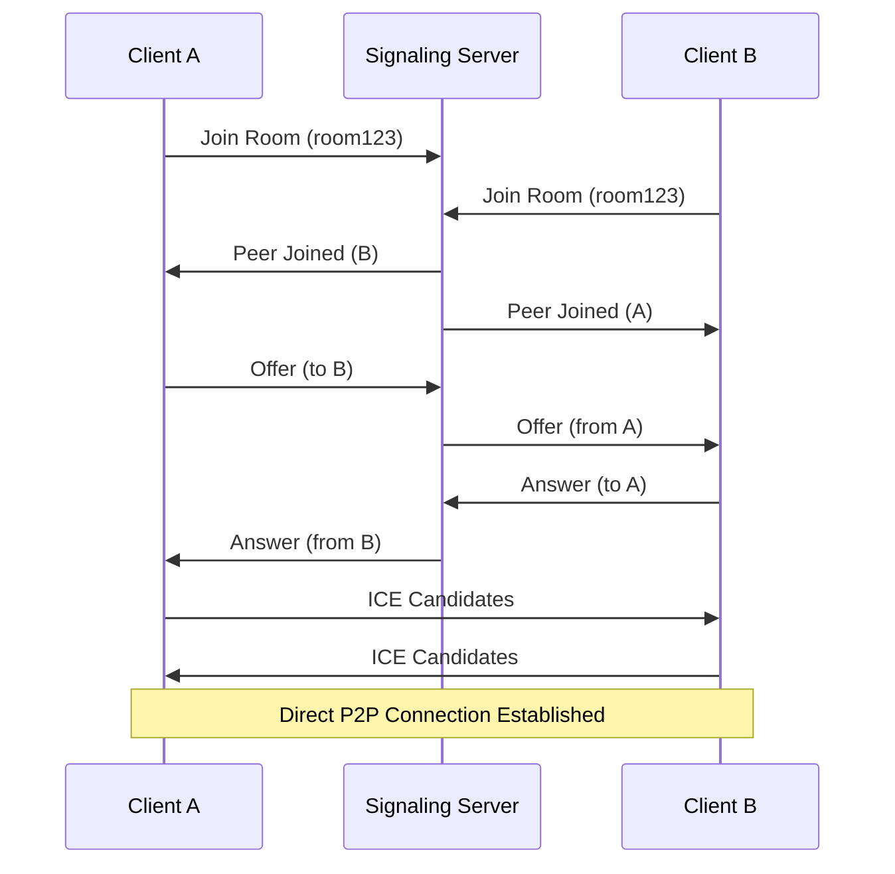
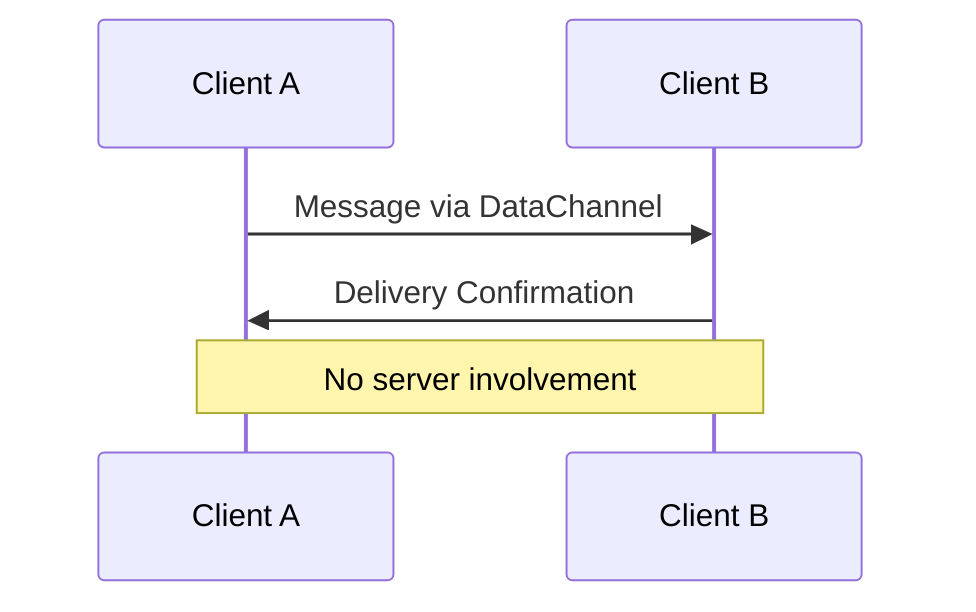
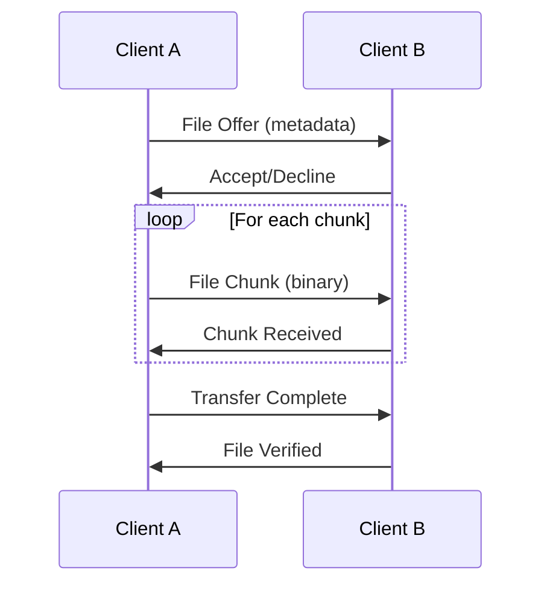

# 🏗️ Technical Architecture Document

## Architecture Overview

### System Architecture Pattern
**Hybrid P2P with Minimal Signaling Server**

```
┌─────────────┐    ┌─────────────────┐    ┌─────────────┐
│   Client A  │    │ Signaling Server│    │   Client B  │
│             │◄──►│   (Socket.IO)   │◄──►│             │
│  React App  │    │                 │    │  React App  │
└─────────────┘    └─────────────────┘    └─────────────┘
       │                                           │
       │            WebRTC P2P Connection         │
       └───────────────────────────────────────────┘
              (Direct Data Transfer)
```

### Core Principles
1. **Minimal Server Dependency**: Server only for connection establishment
2. **Direct P2P Communication**: All data flows directly between peers
3. **Cost Optimization**: Zero bandwidth costs after connection
4. **Privacy First**: No data stored or routed through servers
5. **Progressive Enhancement**: Start simple, add features incrementally

---

## Technology Stack

### Frontend Stack
```yaml
Framework: React 18
Build Tool: Vite 5
Language: TypeScript
Styling: Tailwind CSS
State Management: Zustand
UI Components: Headless UI
Icons: Heroicons
```

### Backend Stack (Signaling Server)
```yaml
Runtime: Node.js 18+
Framework: Express.js
Real-time: Socket.IO
Language: TypeScript
Deployment: Railway/DigitalOcean
Process Manager: PM2
```

### P2P Technology
```yaml
WebRTC: Native browser APIs
STUN Servers: Google's free STUN servers
Data Channels: Ordered, reliable transmission
File Transfer: Chunked binary transfer
Connection Management: Custom reliability layer
```

---

## Component Architecture

### Frontend Components

#### 1. Application Layer
```typescript
// Main application orchestrator
class P2PApp {
  signaling: SignalingClient
  connectionManager: P2PConnectionManager
  messageHandler: MessageHandler
  fileTransfer: FileTransferManager
  ui: UIStateManager
}
```

#### 2. Connection Management
```typescript
// Enhanced P2P connection handling
class P2PConnectionManager {
  connections: Map<string, RTCPeerConnection>
  dataChannels: Map<string, RTCDataChannel>
  reconnectManager: ReconnectionManager
  eventBus: EventEmitter
}
```

#### 3. Signaling Client
```typescript
// Minimal signaling protocol
class SignalingClient {
  socket: Socket
  roomManager: RoomManager
  peerDiscovery: PeerDiscovery
}
```

#### 4. Message System
```typescript
// Reliable message delivery
class MessageHandler {
  messageQueue: MessageQueue
  deliveryTracker: DeliveryTracker
  messageFormatter: MessageFormatter
}
```

#### 5. File Transfer
```typescript
// Chunked file transfer with progress
class FileTransferManager {
  transferSessions: Map<string, TransferSession>
  chunkManager: ChunkManager
  progressTracker: ProgressTracker
}
```

### Backend Components

#### 1. Signaling Server
```typescript
// Ultra-minimal signaling server
class SignalingServer {
  roomManager: RoomManager
  socketHandler: SocketHandler
  messageRelay: MessageRelay
}
```

#### 2. Room Management
```typescript
// Simple room-based peer discovery
class RoomManager {
  rooms: Map<string, Set<string>>
  peerRegistry: Map<string, PeerInfo>
}
```

---

## Data Flow Architecture

### 1. Connection Establishment Flow


### 2. Message Flow


### 3. File Transfer Flow


---

## Security Architecture

### 1. Connection Security
- **WebRTC DTLS**: Automatic encryption for all P2P data
- **SRTP**: Secure media transmission (future video/audio)
- **ICE Security**: Prevents connection hijacking

### 2. Access Control
- **Room-based Access**: Simple room code system
- **Peer Verification**: Connection fingerprint validation
- **No Authentication**: Stateless, session-based access

### 3. Privacy Measures
- **No Data Storage**: Messages never stored on servers
- **Direct Transfer**: Files bypass all servers
- **Ephemeral Rooms**: Rooms auto-delete when empty

---

## Performance Architecture

### 1. Connection Optimization
```typescript
// WebRTC configuration for performance
const rtcConfig = {
  iceServers: [
    { urls: "stun:stun.l.google.com:19302" },
    { urls: "stun:stun1.l.google.com:19302" }
  ],
  iceCandidatePoolSize: 3,
  bundlePolicy: "max-bundle",
  rtcpMuxPolicy: "require"
}
```

### 2. File Transfer Optimization
- **Chunked Transfer**: 16KB chunks for optimal performance
- **Parallel Streams**: Multiple files simultaneously
- **Progress Tracking**: Real-time transfer monitoring
- **Error Recovery**: Automatic chunk retransmission

### 3. UI Performance
- **Virtual Scrolling**: For large message lists
- **Lazy Loading**: Components loaded on demand
- **Debounced Updates**: Smooth typing indicators
- **Optimistic UI**: Instant message display

---

## Scalability Architecture

### 1. Horizontal Scaling Path
```
Phase 1: Pure P2P (2-4 users)
    ↓
Phase 2: P2P with Relay (4-8 users)
    ↓
Phase 3: Hybrid SFU (8-20 users)
    ↓
Phase 4: Full MCU (20+ users)
```

### 2. Server Scaling
- **Stateless Design**: Easy horizontal scaling
- **Load Balancing**: Multiple signaling servers
- **Geographic Distribution**: Regional servers
- **Auto-scaling**: Based on connection count

---

## Error Handling Architecture

### 1. Connection Resilience
```typescript
// Automatic reconnection strategy
class ReconnectionManager {
  maxAttempts: 3
  backoffStrategy: "exponential" // 1s, 2s, 4s
  fallbackMethods: ["relay", "turn"]
}
```

### 2. Graceful Degradation
- **Connection Loss**: Queue messages for reconnection
- **Partial Connectivity**: Continue with available peers
- **Server Outage**: P2P connections remain active
- **Browser Compatibility**: Fallback for older browsers

---

## Monitoring & Observability

### 1. Client-Side Metrics
- Connection success rate
- Message delivery time
- File transfer speed
- Error frequency

### 2. Server-Side Metrics
- Active connections
- Room utilization
- Signaling message volume
- Server resource usage

### 3. Performance Monitoring
```typescript
// Built-in performance tracking
class PerformanceMonitor {
  trackConnectionTime()
  trackMessageLatency()
  trackFileTransferSpeed()
  trackErrorRates()
}
```

---

## Deployment Architecture

### 1. Frontend Deployment
- **Static Hosting**: Vercel/Netlify for frontend
- **CDN Distribution**: Global edge caching
- **Progressive Web App**: Offline capability
- **Auto-deployment**: Git-based CI/CD

### 2. Backend Deployment
- **Container Deployment**: Docker on Railway/DigitalOcean
- **Health Monitoring**: Automatic restart on failure
- **SSL Termination**: HTTPS for signaling
- **Backup Servers**: Multiple regions for reliability

### 3. Cost Optimization
```typescript
// Cost calculator
const monthlyCost = {
  signaling: 5,      // $5 base server
  bandwidth: 0,      // P2P = free
  storage: 0,        // No data storage
  total: 5           // $5/month total
}
```

---

## Development Architecture

### 1. Project Structure
```
p2p-app/
├── apps/
│   ├── frontend/          # React application
│   └── signaling-server/  # Node.js server
├── packages/
│   ├── p2p-core/         # Shared P2P logic
│   ├── ui-components/    # Reusable UI components
│   └── types/            # TypeScript definitions
├── docs/                 # Documentation
└── tools/               # Build and dev tools
```

### 2. Development Workflow
- **Monorepo**: pnpm workspaces for code sharing
- **Type Safety**: Full TypeScript coverage
- **Testing**: Jest + Testing Library
- **Linting**: ESLint + Prettier
- **Git Hooks**: Pre-commit validation

This architecture provides a solid foundation for building a cost-effective, scalable P2P application while maintaining simplicity and performance.
