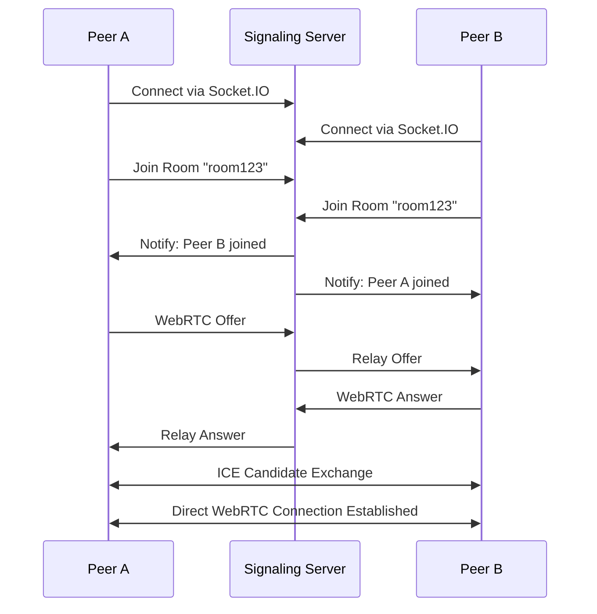
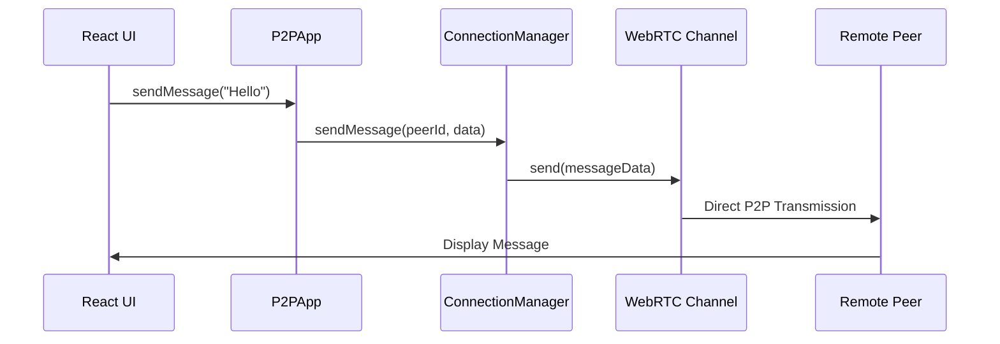
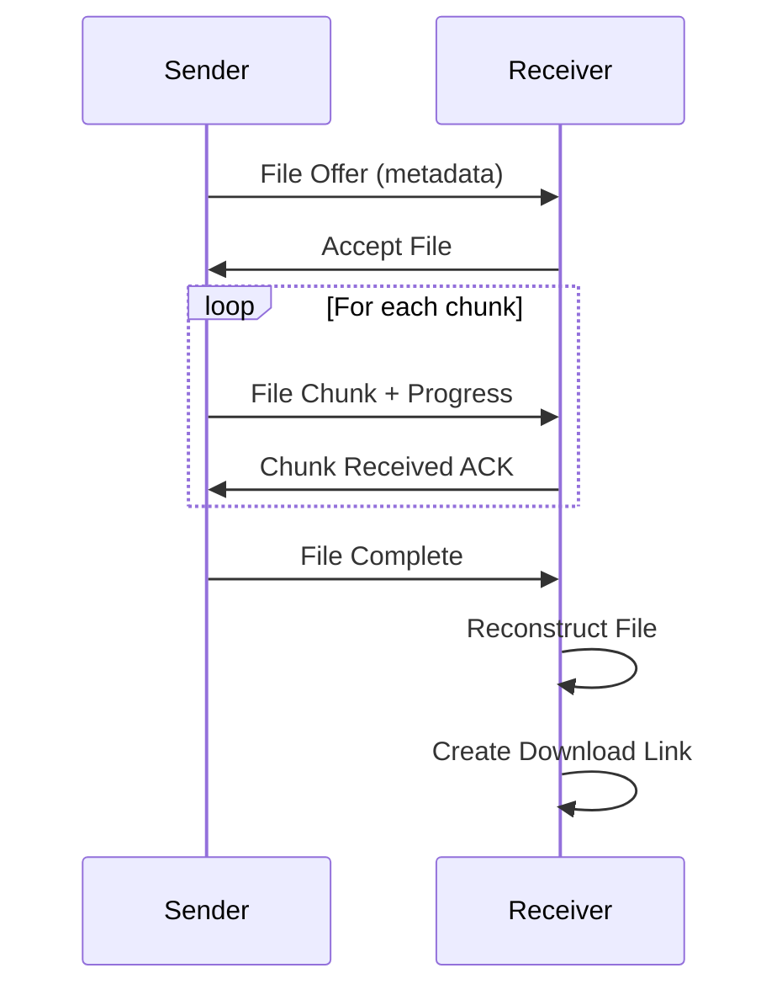

# 03 - Architecture Guide

## 🏗️ P2P Messenger System Architecture

### **Overview**

P2P Messenger implements a **hybrid peer-to-peer architecture** that combines a minimal signaling server for connection establishment with direct WebRTC connections for data transfer. This design minimizes server costs while enabling reliable peer-to-peer communication.

### **🎯 Architectural Principles**

#### **Core Design Principles**

- **Minimal Server Dependency**: Only signaling server required, no message routing
- **Direct P2P Communication**: All data flows directly between peers
- **Scalable Mesh Networks**: Support for multiple peer connections
- **Fault Tolerance**: Automatic reconnection and error recovery
- **Browser-First**: No installation required, web-based implementation

#### **Cost-Effective Design**

- **Signaling-Only Server**: Minimal resource requirements
- **P2P Data Transfer**: No bandwidth costs for messages/files
- **Stateless Server**: No user data storage required
- **Horizontal Scaling**: Add peers without server scaling

### **🔧 System Components**

#### **Frontend Architecture**

```
┌─────────────────────────────────────────────────────────────┐
│                    React Application                        │
├─────────────────────────────────────────────────────────────┤
│  App.jsx (UI Layer)                                        │
│  ├── Connection Status                                      │
│  ├── Room Management                                        │
│  ├── Message Interface                                      │
│  ├── File Transfer UI                                       │
│  └── Peer Management                                        │
├─────────────────────────────────────────────────────────────┤
│                    P2P Core Library                        │
│  ┌─────────────┐ ┌─────────────┐ ┌─────────────┐          │
│  │   P2PApp    │ │ Connection  │ │ Capability  │          │
│  │ (Orchestr.) │ │  Manager    │ │  Manager    │          │
│  └─────────────┘ └─────────────┘ └─────────────┘          │
│  ┌─────────────┐                                           │
│  │  Signaling  │                                           │
│  │   Client    │                                           │
│  └─────────────┘                                           │
├─────────────────────────────────────────────────────────────┤
│                   Browser APIs                             │
│  ┌─────────────┐ ┌─────────────┐ ┌─────────────┐          │
│  │   WebRTC    │ │ WebSocket   │ │   File API  │          │
│  │     API     │ │     API     │ │             │          │
│  └─────────────┘ └─────────────┘ └─────────────┘          │
└─────────────────────────────────────────────────────────────┘
```

#### **Backend Architecture**

```
┌─────────────────────────────────────────────────────────────┐
│                 Signaling Server                           │
├─────────────────────────────────────────────────────────────┤
│  Express.js HTTP Server                                    │
│  ├── Static File Serving                                   │
│  ├── CORS Configuration                                     │
│  └── Health Check Endpoints                                │
├─────────────────────────────────────────────────────────────┤
│  Socket.IO WebSocket Server                                │
│  ├── Room Management                                        │
│  ├── Peer Discovery                                         │
│  ├── WebRTC Signaling Relay                               │
│  └── Connection State Tracking                             │
├─────────────────────────────────────────────────────────────┤
│                 Node.js Runtime                            │
└─────────────────────────────────────────────────────────────┘
```

### **🔄 Communication Flow**

#### **1. Connection Establishment Flow**



#### **2. Message Flow**



#### **3. File Transfer Flow**



### **📦 Core Components Deep Dive**

#### **P2PApp Class**

**Purpose**: Main application orchestrator that coordinates all P2P functionality

**Key Responsibilities**:

- Manages signaling connection lifecycle
- Coordinates WebRTC connection establishment
- Handles message routing and file transfers
- Manages peer capabilities and service discovery
- Provides high-level API for React components

**Key Methods**:

```javascript
// Connection management
async connect()                    // Connect to signaling server
async joinRoom(roomId)            // Join a room for peer discovery
async sendMessage(message)        // Send message to all peers
disconnect()                      // Clean disconnect and cleanup
getCurrentRoom()                  // Get current room ID

// File transfer
async shareFile(file)             // Share file with all peers
handleFileOffer(peerId, metadata) // Handle incoming file offers

// Capability management
getLocalCapabilities()            // Get local peer capabilities
getAllRemotePeerCapabilities()    // Get all remote peer capabilities
getRemotePeerCapabilities(peerId) // Get specific peer capabilities
findPeersWithService(serviceType) // Find peers with specific services
providesService(serviceType)      // Check if local peer provides service
updateCapabilities(updates)       // Update local capabilities

// Connection quality and mesh management
getAllConnectionQualities()       // Get all connection quality metrics
validateMeshConnections()         // Validate mesh network integrity
```

#### **P2PConnectionManager Class**

**Purpose**: Manages WebRTC connections and data channels

**Key Responsibilities**:

- Creates and manages RTCPeerConnection instances
- Handles data channel creation and management
- Implements connection reliability and reconnection
- Monitors connection quality and performance
- Manages service-aware connections

**Key Features**:

```javascript
// Connection management
async createConnection(peerId, isInitiator)  // Create WebRTC connection
async sendReliable(peerId, data, options)    // Send with reliability and options
cleanup(peerId)                             // Clean up connections
getConnectedPeers()                         // Get list of connected peer IDs
hasConnection(peerId)                       // Check if peer has working connection
isDataChannelOpen(peerId)                   // Check data channel status

// Service-aware connections
createServiceConnection(peerId, serviceType, isInitiator) // Service-specific connections
getServiceConnections(serviceType)          // Get connections for service
getPeerServices(peerId)                     // Get services for peer
peerProvidesService(peerId, serviceType)    // Check if peer provides service

// Quality monitoring
startPeerQualityMonitoring(peerId)          // Monitor connection quality
getConnectionQuality(peerId)                // Get quality metrics
getConnectionStatus(peerId)                 // Get detailed connection status
```

#### **MinimalSignaling Class**

**Purpose**: Handles signaling server communication via Socket.IO

**Key Responsibilities**:

- Establishes WebSocket connection to signaling server
- Manages room joining and peer discovery
- Relays WebRTC signaling messages (offers, answers, ICE candidates)
- Handles connection state and error management

**Key Methods**:

```javascript
async connect()                   // Connect to signaling server
async joinRoom(roomId)           // Join room for peer discovery
sendOffer(offer)                 // Send WebRTC offer
sendAnswer(answer)               // Send WebRTC answer
sendIceCandidate(candidate)      // Send ICE candidate
```

#### **PeerCapabilityManager Class**

**Purpose**: Manages peer capabilities and service discovery

**Key Responsibilities**:

- Tracks local and remote peer capabilities
- Manages service discovery and advertisement
- Handles role-based peer management
- Monitors peer performance and reliability

**Capability Types**:

```javascript
{
  role: "BASIC" | "RELAY" | "SUPER_PEER",
  services: ["messaging", "file_transfer", "relay"],
  resources: {
    maxConnections: 10,
    maxBandwidth: "10mbps",
    availableStorage: 100
  },
  location: {
    region: "us-east",
    timezone: "America/New_York"
  }
}
```

### **🌐 Network Architecture**

#### **Mesh Network Topology**

```
     Peer A ←→ Peer B
        ↕       ↕
     Peer D ←→ Peer C
```

**Characteristics**:

- **Full Mesh**: Each peer connects to every other peer
- **Redundancy**: Multiple paths for message delivery
- **Scalability**: Limited by browser connection limits (~10-20 peers)
- **Reliability**: Automatic failover if connections drop

#### **WebRTC Data Channels**

**Configuration**:

```javascript
const dataChannelConfig = {
  ordered: true, // Maintain message order
  maxRetransmits: 3, // Retry failed transmissions
  protocol: "p2p-messenger", // Custom protocol identifier
};
```

**Features**:

- **Reliable Delivery**: TCP-like reliability with retransmissions
- **Low Latency**: Direct peer-to-peer communication
- **High Throughput**: No server bandwidth limitations
- **Secure**: DTLS encryption by default

### **🔒 Security Architecture**

#### **Built-in Security Features**

- **DTLS Encryption**: All WebRTC data channels encrypted by default
- **ICE/STUN**: NAT traversal with security considerations
- **Origin Validation**: CORS protection on signaling server
- **Input Sanitization**: Message content validation

#### **Security Considerations**

- **No End-to-End Encryption**: Messages visible to WebRTC layer
- **Peer Discovery**: Room-based discovery exposes peer presence
- **File Transfer**: No virus scanning or content validation
- **Network Exposure**: Direct IP address sharing via ICE

### **📊 Performance Characteristics**

#### **Scalability Limits**

- **Peer Count**: ~10-20 peers per mesh (browser dependent)
- **Message Throughput**: ~1000 messages/second per connection
- **File Transfer**: Limited by browser memory and connection bandwidth
- **Connection Setup**: ~2-5 seconds for WebRTC establishment

#### **Resource Usage**

- **Memory**: ~10-50MB per peer connection
- **CPU**: Low usage for messaging, higher for file transfer
- **Network**: Direct P2P, no server bandwidth usage
- **Storage**: Temporary file storage in browser memory

### **🔧 Configuration and Extensibility**

#### **Configurable Components**

```javascript
// P2PApp configuration
const config = {
  signalingServer: "http://localhost:4000",
  webrtc: {
    iceServers: [{ urls: "stun:stun.l.google.com:19302" }],
    dataChannelConfig: { ordered: true, maxRetransmits: 3 },
  },
  capabilities: {
    role: "BASIC",
    services: ["messaging", "file_transfer"],
    maxConnections: 10,
  },
};
```

#### **Extension Points**

- **Custom Message Types**: Add new message handlers
- **Service Plugins**: Extend capability management
- **Transport Layers**: Alternative to WebRTC (WebSocket fallback)
- **UI Components**: Custom React components for new features

### **🚀 Deployment Architecture**

#### **Development Environment**

```
┌─────────────────┐    ┌─────────────────┐
│   Vite Dev      │    │  Node.js Dev    │
│   Server        │    │   Server        │
│  (Port 3000)    │    │  (Port 4000)    │
│                 │    │                 │
│ - Hot Reload    │    │ - Auto Restart  │
│ - Source Maps   │    │ - Debug Logs    │
│ - Fast Builds   │    │ - CORS Enabled  │
└─────────────────┘    └─────────────────┘
```

#### **Production Environment**

```
┌─────────────────┐    ┌─────────────────┐
│   Static CDN    │    │ Signaling Server│
│   (Frontend)    │    │   (Backend)     │
│                 │    │                 │
│ - Netlify       │    │ - Railway       │
│ - Vercel        │    │ - Heroku        │
│ - GitHub Pages  │    │ - DigitalOcean  │
└─────────────────┘    └─────────────────┘
```

### **🔄 Data Flow Patterns**

#### **Event-Driven Architecture**

```javascript
// Event flow example
P2PApp → emit('peer-ready') → React Component → Update UI
P2PApp → emit('message') → React Component → Display Message
P2PApp → emit('file-received') → React Component → Show Download
```

#### **State Management**

- **React State**: UI state and user interactions
- **P2P State**: Connection state and peer management
- **Browser State**: WebRTC connections and file storage
- **Server State**: Room membership and signaling

This architecture provides a solid foundation for peer-to-peer communication while maintaining simplicity and cost-effectiveness.
