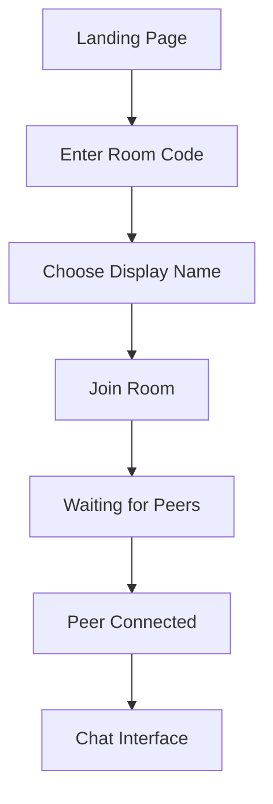
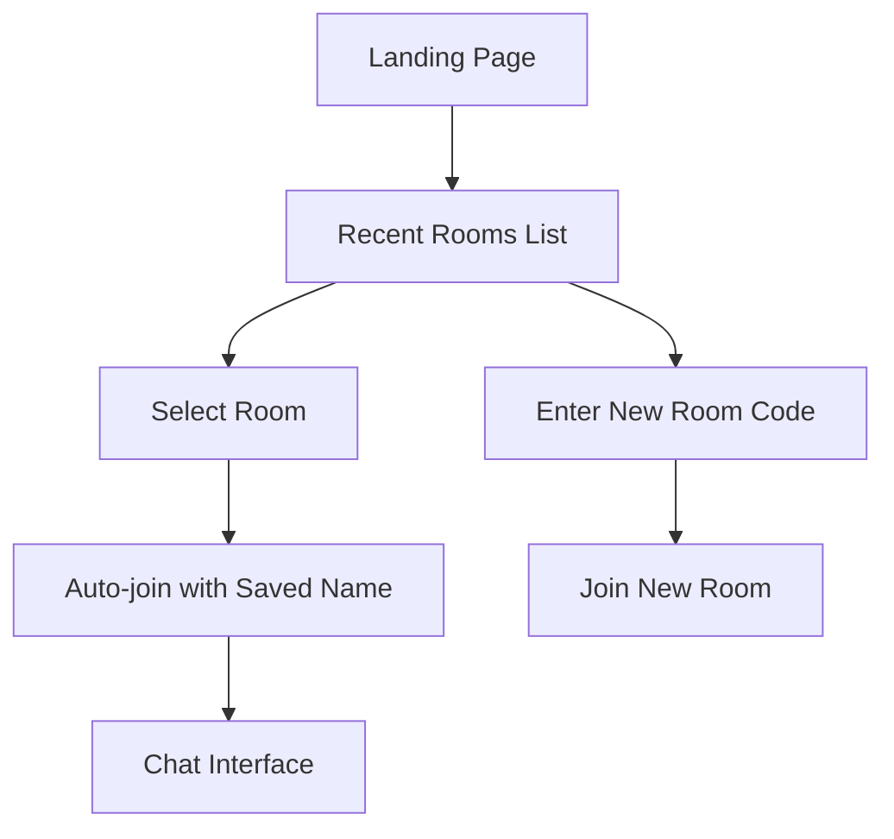
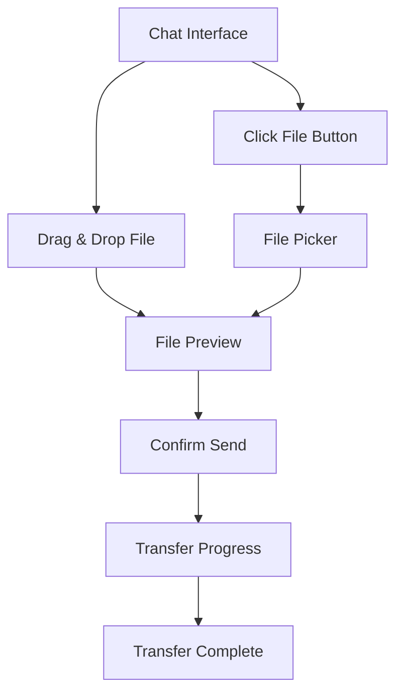

# 🎨 UI/UX Design Document

## Design Philosophy

### Core Principles
1. **Simplicity First**: Clean, uncluttered interface focusing on core functionality
2. **Mobile-First**: Responsive design optimized for mobile devices
3. **Instant Feedback**: Real-time visual feedback for all user actions
4. **Privacy-Focused**: Clear indicators of P2P status and data flow
5. **Accessibility**: WCAG 2.1 AA compliance for inclusive design

### Design Language
- **Modern Minimalism**: Clean lines, generous whitespace, subtle shadows
- **Telegram-Inspired**: Familiar chat patterns with P2P enhancements
- **AirDrop-Style**: Intuitive file sharing with visual progress indicators
- **Dark/Light Themes**: System preference detection with manual override

---

## User Flows

### 1. First-Time User Flow


### 2. Returning User Flow


### 3. File Sharing Flow


---

## Screen Layouts

### 1. Landing Page
```
┌─────────────────────────────────────┐
│              P2P Chat               │
│         Direct & Private            │
│                                     │
│  ┌─────────────────────────────┐   │
│  │     Enter Room Code         │   │
│  │  [ABC123]                   │   │
│  └─────────────────────────────┘   │
│                                     │
│  ┌─────────────────────────────┐   │
│  │        Join Room            │   │
│  └─────────────────────────────┘   │
│                                     │
│           Recent Rooms              │
│  • Gaming Session (2 hours ago)    │
│  • Work Files (Yesterday)          │
│                                     │
│     🔒 No data stored on servers    │
└─────────────────────────────────────┘
```

### 2. Chat Interface (Desktop)
```
┌─────────────────────────────────────────────────────────┐
│ P2P Chat - Room: ABC123                    [⚙️] [🌙]    │
├─────────────────────────────────────────────────────────┤
│ Peers (2)          │                                    │
│ • Alice (You)      │  Alice: Hey! Ready to share files? │
│ • Bob 🟢          │  Bob: Yes! Send me the docs        │
│                    │                                    │
│ Connection: P2P    │  [📎 document.pdf - 2.3MB]        │
│ Status: Connected  │  ████████████ 100% Complete       │
│                    │                                    │
│                    │  Alice: Perfect! Got it?          │
│                    │  Bob: ✓ Received                   │
│                    │                                    │
│                    │  Bob is typing...                  │
│                    │                                    │
├────────────────────┼────────────────────────────────────┤
│                    │ [📎] Type a message... [Send]      │
└─────────────────────────────────────────────────────────┘
```

### 3. Chat Interface (Mobile)
```
┌─────────────────────────┐
│ ABC123        [⚙️] [🌙] │
├─────────────────────────┤
│                         │
│ Alice: Hey! Ready to    │
│ share files?            │
│                         │
│      Bob: Yes! Send me  │
│      the docs           │
│                         │
│ [📎 document.pdf]       │
│ ████████ 100%          │
│                         │
│ Alice: Perfect!         │
│                         │
│      Bob: ✓ Received    │
│                         │
│ Bob is typing...        │
│                         │
├─────────────────────────┤
│ [📎] Message... [Send]  │
└─────────────────────────┘
```

---

## Component Design

### 1. Message Bubble
```typescript
interface MessageBubbleProps {
  message: {
    id: string;
    content: string;
    sender: string;
    timestamp: number;
    isOwn: boolean;
    status: 'sending' | 'delivered' | 'read';
  };
}
```

**Visual States**:
- **Own Messages**: Right-aligned, blue background
- **Other Messages**: Left-aligned, gray background
- **Status Indicators**: ⏳ Sending, ✓ Delivered, ✓✓ Read
- **Timestamps**: Subtle, shown on hover/tap

### 2. File Transfer Component
```typescript
interface FileTransferProps {
  file: {
    name: string;
    size: number;
    type: string;
    preview?: string;
  };
  progress: number;
  status: 'pending' | 'transferring' | 'complete' | 'error';
  onAccept?: () => void;
  onDecline?: () => void;
}
```

**Visual Elements**:
- **File Icon**: Type-specific icons (📄 📷 🎵 📹)
- **Progress Bar**: Animated progress with speed indicator
- **File Preview**: Thumbnail for images
- **Action Buttons**: Accept/Decline for incoming files

### 3. Peer List Component
```typescript
interface PeerListProps {
  peers: Array<{
    id: string;
    displayName: string;
    status: 'connecting' | 'connected' | 'disconnected';
    isTyping: boolean;
  }>;
}
```

**Visual Indicators**:
- **Status Dots**: 🟢 Connected, 🟡 Connecting, 🔴 Disconnected
- **Typing Indicator**: Animated dots when typing
- **Connection Quality**: Signal strength bars

### 4. Connection Status Bar
```typescript
interface ConnectionStatusProps {
  status: 'connecting' | 'connected' | 'disconnected' | 'reconnecting';
  peerCount: number;
  connectionType: 'p2p' | 'relay' | 'server';
}
```

**Visual States**:
- **Connected**: Green bar with P2P indicator
- **Connecting**: Yellow bar with spinner
- **Disconnected**: Red bar with retry button
- **Reconnecting**: Orange bar with attempt counter

---

## Interaction Patterns

### 1. File Sharing Interactions

#### Drag & Drop
```
User Action: Drag file over chat area
Visual Feedback: Overlay with "Drop to share" message
Drop Zone: Entire chat area becomes drop target
Animation: Smooth fade-in/out of overlay
```

#### File Selection
```
User Action: Click file attachment button
Visual Feedback: File picker opens
Multi-select: Ctrl/Cmd + click for multiple files
Preview: Show file details before sending
```

#### Transfer Progress
```
Visual Elements:
- Progress bar with percentage
- Transfer speed (MB/s)
- Estimated time remaining
- Cancel button during transfer
- Success/error states with icons
```

### 2. Message Interactions

#### Typing Indicators
```
Trigger: User starts typing
Display: "User is typing..." with animated dots
Timeout: Hide after 3 seconds of inactivity
Multiple Users: "Alice and Bob are typing..."
```

#### Message Status
```
Visual Indicators:
- ⏳ Sending (gray)
- ✓ Delivered (gray)
- ✓✓ Read (blue)
- ❌ Failed (red with retry option)
```

### 3. Connection Management

#### Auto-Reconnection
```
Visual Feedback:
- Connection lost banner
- Reconnection attempt counter
- Progress indicator
- Manual retry button
```

#### Peer Discovery
```
Visual Elements:
- "Waiting for peers..." state
- Peer join notifications
- Connection establishment progress
- P2P status confirmation
```

---

## Responsive Design

### Breakpoints
```css
/* Mobile First Approach */
.mobile { max-width: 767px; }
.tablet { min-width: 768px; max-width: 1023px; }
.desktop { min-width: 1024px; }
```

### Layout Adaptations

#### Mobile (< 768px)
- Single column layout
- Full-width message bubbles
- Bottom sheet for peer list
- Simplified file transfer UI
- Touch-optimized buttons (44px min)

#### Tablet (768px - 1023px)
- Two-column layout (peers + chat)
- Collapsible peer sidebar
- Enhanced file preview
- Gesture support for navigation

#### Desktop (> 1024px)
- Three-column layout (peers + chat + details)
- Keyboard shortcuts
- Drag & drop from desktop
- Multiple file selection
- Hover states and tooltips

---

## Accessibility Features

### Keyboard Navigation
- **Tab Order**: Logical focus flow
- **Shortcuts**: Ctrl+Enter to send, Esc to cancel
- **Focus Indicators**: Clear visual focus states
- **Screen Reader**: Proper ARIA labels and roles

### Visual Accessibility
- **Color Contrast**: 4.5:1 minimum ratio
- **Font Sizes**: Scalable text (16px base)
- **Motion**: Reduced motion preference support
- **High Contrast**: Alternative color schemes

### Assistive Technology
- **Screen Readers**: Semantic HTML structure
- **Voice Control**: Voice-friendly button labels
- **Switch Navigation**: Single-switch compatibility
- **Magnification**: Zoom support up to 200%

---

## Theme System

### Color Palette

#### Light Theme
```css
:root {
  --bg-primary: #ffffff;
  --bg-secondary: #f8fafc;
  --text-primary: #1f2937;
  --text-secondary: #6b7280;
  --accent: #3b82f6;
  --success: #10b981;
  --warning: #f59e0b;
  --error: #ef4444;
}
```

#### Dark Theme
```css
:root[data-theme="dark"] {
  --bg-primary: #111827;
  --bg-secondary: #1f2937;
  --text-primary: #f9fafb;
  --text-secondary: #d1d5db;
  --accent: #60a5fa;
  --success: #34d399;
  --warning: #fbbf24;
  --error: #f87171;
}
```

### Typography
```css
/* Font Stack */
font-family: -apple-system, BlinkMacSystemFont, 'Segoe UI', 
             Roboto, Oxygen, Ubuntu, Cantarell, sans-serif;

/* Scale */
--text-xs: 0.75rem;    /* 12px */
--text-sm: 0.875rem;   /* 14px */
--text-base: 1rem;     /* 16px */
--text-lg: 1.125rem;   /* 18px */
--text-xl: 1.25rem;    /* 20px */
```

This design system ensures a consistent, accessible, and delightful user experience across all devices while maintaining the simplicity and privacy focus of the P2P architecture.
