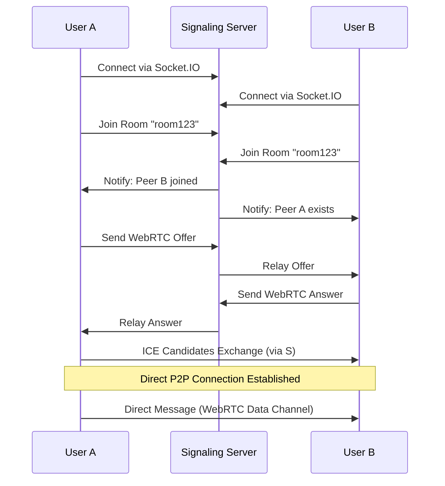
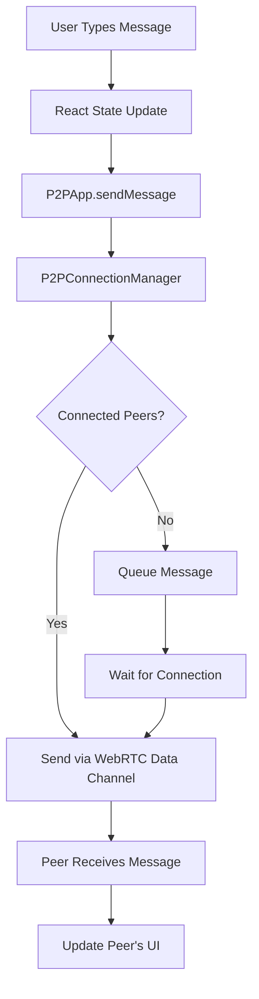

# 🏗️ P2P Messenger Architecture

## Overview

The P2P Messenger is built on a hybrid architecture that combines a minimal centralized signaling server with direct peer-to-peer communication. This design minimizes server costs while enabling real-time, direct communication between users.

## High-Level Architecture

```
┌─────────────────┐    ┌─────────────────┐    ┌─────────────────┐
│   Browser A     │    │  Signaling      │    │   Browser B     │
│                 │    │  Server         │    │                 │
│  ┌───────────┐  │    │  (Node.js +     │    │  ┌───────────┐  │
│  │ React App │  │    │   Socket.IO)    │    │  │ React App │  │
│  └───────────┘  │    │                 │    │  └───────────┘  │
│  ┌───────────┐  │    │  Port: 4000     │    │  ┌───────────┐  │
│  │ P2P Stack │  │◄──►│                 │◄──►│  │ P2P Stack │  │
│  └───────────┘  │    └─────────────────┘    │  └───────────┘  │
└─────────────────┘                           └─────────────────┘
         │                                             │
         │              WebRTC Data Channel            │
         └─────────────────────────────────────────────┘
                    (Direct P2P Connection)
```

## Core Components

### 1. Frontend Architecture (React)

#### Component Hierarchy

```
App.jsx (Root Component)
├── Connection Status Display
├── Room Controls
├── Message Display Area
├── Message Input
└── Peers List
```

#### Core Libraries

- **P2PApp.js**: Main orchestrator class
- **P2PConnectionManager.js**: WebRTC connection management
- **MinimalSignaling.js**: Signaling server communication

### 2. Backend Architecture (Node.js)

#### Signaling Server Components

```
Express Server
├── HTTP Server (Basic routing)
├── Socket.IO Server (WebSocket handling)
├── Room Management (In-memory)
└── Message Relay (WebRTC signaling)
```

## Data Flow Diagrams

### 1. Connection Establishment Flow



### 2. Message Flow



## Component Relationships

### Frontend Component Interaction

```
┌─────────────────────────────────────────────────────────────┐
│                        App.jsx                              │
│  ┌─────────────────────────────────────────────────────┐    │
│  │                   P2PApp                            │    │
│  │  ┌─────────────────┐  ┌─────────────────────────┐   │    │
│  │  │ MinimalSignaling│  │ P2PConnectionManager    │   │    │
│  │  │                 │  │                         │   │    │
│  │  │ - Socket.IO     │  │ - WebRTC Management     │   │    │
│  │  │ - Room Mgmt     │  │ - Data Channels         │   │    │
│  │  │ - Event Relay   │  │ - Connection State      │   │    │
│  │  └─────────────────┘  └─────────────────────────┘   │    │
│  └─────────────────────────────────────────────────────┘    │
└─────────────────────────────────────────────────────────────┘
```

### Backend Component Interaction

```
┌─────────────────────────────────────────────────────────────┐
│                   Express Server                            │
│  ┌─────────────────────────────────────────────────────┐    │
│  │                 Socket.IO Server                    │    │
│  │  ┌─────────────────┐  ┌─────────────────────────┐   │    │
│  │  │ Connection Mgmt │  │ Room Management         │   │    │
│  │  │                 │  │                         │   │    │
│  │  │ - Client Sockets│  │ - Room Participants     │   │    │
│  │  │ - Event Handling│  │ - Message Relay         │   │    │
│  │  │ - Cleanup       │  │ - Peer Notifications    │   │    │
│  │  └─────────────────┘  └─────────────────────────┘   │    │
│  └─────────────────────────────────────────────────────┘    │
└─────────────────────────────────────────────────────────────┘
```

## WebRTC Architecture

### Connection States

1. **Disconnected**: No connection to signaling server
2. **Connecting**: Establishing signaling connection
3. **Connected**: Connected to signaling server
4. **Joining**: Joining a room
5. **In Room**: Room joined, waiting for peers
6. **Peer Discovery**: Found peers, initiating WebRTC
7. **P2P Connected**: Direct peer connection established

### WebRTC Configuration

```javascript
const rtcConfig = {
  iceServers: [
    { urls: "stun:stun.l.google.com:19302" },
    { urls: "stun:stun1.l.google.com:19302" },
  ],
  iceCandidatePoolSize: 10,
};
```

## Security Considerations

### Current Security Measures

- **CORS Configuration**: Restricts cross-origin requests
- **Input Validation**: Basic message content validation
- **Connection Limits**: Per-room participant limits

### Security Limitations

- **No Authentication**: Users are anonymous
- **No Encryption**: Messages sent in plain text over WebRTC
- **No Rate Limiting**: No protection against spam
- **No Message Persistence**: Messages not stored server-side

### Recommended Enhancements

- Implement end-to-end encryption
- Add user authentication
- Implement rate limiting
- Add message signing/verification
- Secure room access controls

## Scalability Patterns

### Current Limitations

- **In-Memory Storage**: Room data lost on server restart
- **Single Server**: No horizontal scaling
- **No Load Balancing**: Single point of failure

### Scaling Strategies

1. **Horizontal Scaling**: Multiple signaling servers with Redis
2. **Database Integration**: Persistent room and user data
3. **Load Balancing**: Distribute signaling load
4. **CDN Integration**: Static asset delivery
5. **Microservices**: Separate signaling and web services

## Performance Characteristics

### Signaling Server Performance

- **Memory Usage**: ~50MB base + ~1KB per connected user
- **CPU Usage**: Minimal (event-driven architecture)
- **Network**: Low bandwidth (only signaling messages)
- **Connections**: Supports 1000+ concurrent connections

### P2P Performance

- **Latency**: Direct connection (typically <50ms)
- **Bandwidth**: No server bandwidth usage for messages
- **Throughput**: Limited by peer connection quality
- **Reliability**: Depends on peer network stability

## Error Handling Strategy

### Connection Errors

- Automatic reconnection to signaling server
- Graceful degradation when peers disconnect
- User notification of connection issues

### WebRTC Errors

- ICE connection failure handling
- Data channel error recovery
- Peer connection timeout handling

### User Experience

- Clear error messages
- Connection status indicators
- Automatic retry mechanisms
- Fallback communication methods
